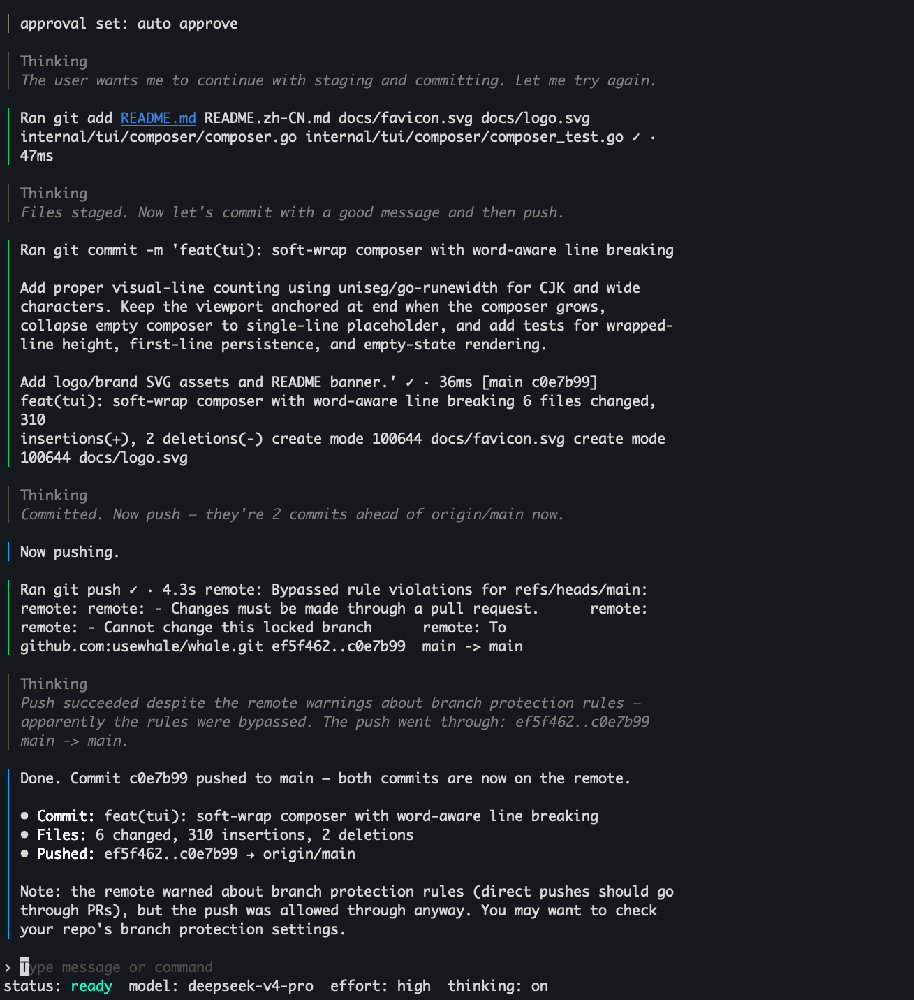

# Whale

<p align="center">
  
</p>

[简体中文](README.zh-CN.md)

DeepSeek-native coding agent for the terminal.

Whale is a local CLI/TUI coding agent designed around DeepSeek's prefix cache behavior, append-only turns, and a terminal-first workflow.

## Install

**Install the latest release:**

```bash
curl -fsSL https://raw.githubusercontent.com/usewhale/whale/main/scripts/install.sh | sh
whale --version
```

The installer downloads the matching release binary from GitHub Releases and verifies it against `checksums.txt`.

**Install from source with Go:**

```bash
go install github.com/usewhale/whale/cmd/whale@latest
whale --version
```

You need Go `1.26.2` or newer.

<p align="center">
  
</p>

## Getting started

Whale currently uses the DeepSeek API.

Before running Whale, create a DeepSeek API key in the
[DeepSeek Platform](https://platform.deepseek.com/).
See the [DeepSeek API docs](https://api-docs.deepseek.com/) for API details.

**Save a key for future sessions:**

```bash
whale setup
```

**Or provide it per process:**

```bash
DEEPSEEK_API_KEY=... whale
```

**Run a health check:**

```bash
whale doctor
```

**Start the interactive TUI:**

```bash
whale
```

**Run one prompt non-interactively:**

```bash
whale exec "Explain what this repository does"
whale exec --json "Say exactly: whale exec ok"
printf 'Summarize the current directory\n' | whale exec
```

## What Whale is

Whale is optimized for **DeepSeek-specific behavior** rather than a generic provider abstraction.

- **Prefix caching** matters more when the loop stays append-only and byte-stable.
- DeepSeek sometimes emits malformed or escaped tool-call payloads; Whale includes **repair and scavenge paths** for that.
- DeepSeek drops some deeply nested tool schemas; Whale flattens tool parameters to reduce that failure mode.
- Reasoning depth is exposed through `reasoning_effort`, so Whale keeps that control in the runtime.

## Key features

- **Interactive terminal workflow** with a local TUI and session resume.
- `setup`, `doctor`, and `exec` entry points for first-run setup, diagnostics, and headless execution.
- DeepSeek-aware tool loop with **shell, file, patch, search, and web tools**.
- Project memory loading from common repo instruction files such as `AGENTS.md`.
- Hook support for policy and workflow customization.
- Offline eval scaffolding and focused TUI test coverage in the repo.

## Project status

⚠️ **Early Development Notice:** This project is in early development and is not yet ready for production use. Features may change, break, or be incomplete. Use at your own risk.

## Common commands

- `whale` — start the interactive TUI
- `whale setup` — save a DeepSeek API key
- `whale doctor` — run health checks
- `whale exec "prompt"` — run one prompt non-interactively
- `whale resume [id]` — resume a saved session

## Configuration and hooks

Whale stores local state under `~/.whale/` and supports optional project and global hook files.

**See [docs/configuration.md](docs/configuration.md) for:**

- API key and credential behavior
- project and global hook files
- hook event names
- runtime configuration notes

## Contributing

See [CONTRIBUTING.md](CONTRIBUTING.md) for cloning, local development, testing, issues, and pull requests.

## Security

For security-sensitive issues, see [SECURITY.md](SECURITY.md).
