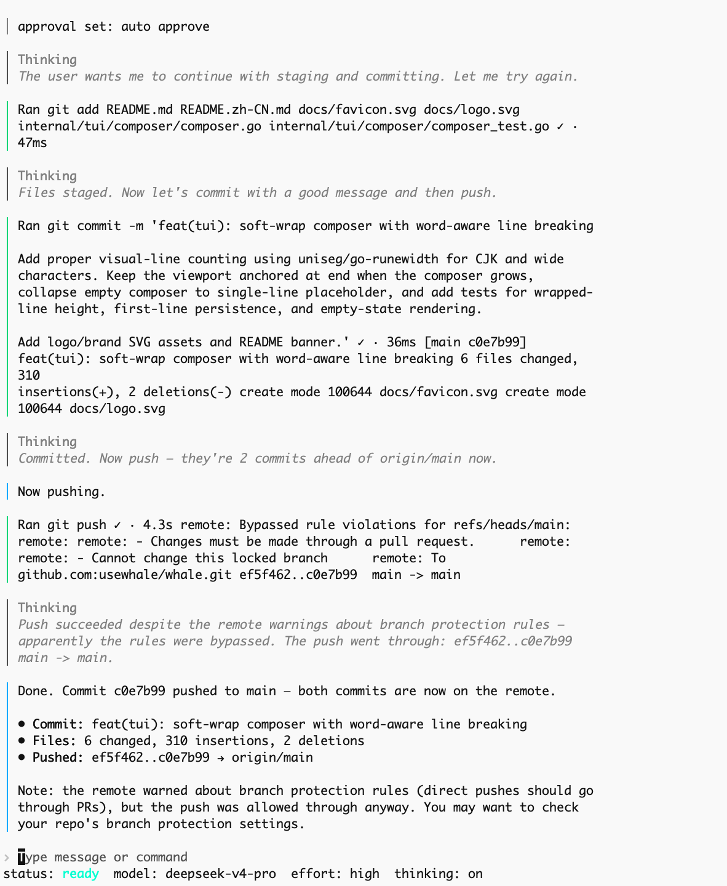

# Whale

<p align="center">
  
</p>

<p align="center">
  <strong>简体中文</strong> · <a href="./README.en.md">English</a>
</p>

<p align="center">
  <a href="https://github.com/usewhale/whale/releases"></a>
  <a href="https://github.com/usewhale/whale/actions/workflows/ci.yml"></a>
  <a href="./LICENSE"></a>
  <a href="https://github.com/usewhale/whale/stargazers"></a>
</p>

<p align="center">
  <strong>Whale 是一个非官方的 DeepSeek CLI / DeepSeek 编程 Agent。</strong><br>
  运行在终端里，支持读代码、改代码、运行命令、MCP 和 Skills。
</p>

<p align="center">
  <strong>90% live prefix-cache hit</strong> · <strong>~30x cheaper per task vs Claude Code</strong> · terminal-first · open source
</p>

<p align="center"><a href="./ROADMAP.md">📋 开发路线图 · 查看当前方向和可认领任务</a></p>

---

## 快速开始

使用脚本安装：

```bash
curl -fsSL https://raw.githubusercontent.com/usewhale/whale/main/scripts/install.sh | sh
```

使用 Homebrew 安装：

```bash
brew install usewhale/tap/whale
```


首次运行：

```bash
whale setup
whale doctor
whale
```

升级：

```bash
brew upgrade usewhale/tap/whale
# 或重新运行安装脚本
```

Whale 当前使用 DeepSeek API。运行前请先在 [DeepSeek Platform](https://platform.deepseek.com/) 创建 API key。API 细节见 [DeepSeek API docs](https://api-docs.deepseek.com/)。

> **平台支持：** Whale 当前支持 **macOS** 和 **Linux**。Windows 支持正在开发中，敬请期待。

<p align="center">
  
</p>

也可以直接运行一次性任务：

```bash
whale exec "解释这个仓库是做什么的"
printf '总结当前目录\n' | whale exec
```

---

## 和其他工具有什么区别

|                          | Whale | Claude Code | Codex CLI | Cursor | Aider |
|--------------------------|-------|-------------|-----------|--------|-------|
| 主要形态                 | 终端 TUI/CLI | 终端 Agent | 终端 Agent | IDE | CLI |
| 默认后端                 | DeepSeek | Anthropic | OpenAI | 多模型 | 多模型 |
| DeepSeek 优化            | 是 | 否 | 否 | 否 | 有限 |
| Prefix-cache 友好        | 是 | n/a | n/a | 取决于模型 | 有限 |
| 本地读写代码             | 是 | 是 | 是 | 是 | 是 |
| 运行 shell / test        | 是 | 是 | 是 | 部分 | 是 |
| `/ask` 只读模式          | 是 | 部分 | 部分 | n/a | 部分 |
| `/plan` 规划模式         | 是 | 是 | 是 | n/a | 部分 |
| MCP                      | 是 | 是 | 取决于版本 | 部分 | 部分 |
| Skills / 工作流复用      | 是 | 是 | 是 | 部分 | 有限 |
| 开源                     | 是 | 否 | 是 | 否 | 是 |

Whale 的重点不是“支持最多模型”，而是把 DeepSeek API 变成一个更稳定、便宜、适合长时间打开的本地编程 Agent。

<details>
<summary><strong>为什么 DeepSeek-only？</strong></summary>

DeepSeek 的低价只是第一层优势。真正适合做长会话编程 Agent 的关键，是 prefix cache。

DeepSeek 的 prefix cache 对字节稳定很敏感。Whale 的工具循环围绕这个特点设计：尽量保持追加式 turn、稳定的上下文顺序和可恢复的会话记录，让长任务能持续吃到缓存收益。

这也是 Whale 不急着做通用 provider 抽象的原因。Claude、OpenAI、DeepSeek 的缓存机制、tool-call 形态和 reasoning 行为并不一样。强行套一层通用接口，通常会牺牲 DeepSeek 最有价值的部分。

Whale 针对 DeepSeek 做了这些适配：

| 通用 Agent 常见假设 | DeepSeek 实际会发生 | Whale 的处理 |
|---------------------|---------------------|--------------|
| tool-call JSON 总是稳定 | payload 可能 malformed、被转义或混进 reasoning | schema-guided repair / scavenge 路径 |
| 深层 tool schema 能稳定保留 | 部分深层嵌套参数可能丢失 | 工具参数尽量扁平化 |
| 失败工具需要统一 replan | 有些失败应该原样反馈给模型 | 更细的失败分类和 recovery 策略 |
| 用户取消就是普通工具失败 | 取消后不应该继续恢复或补计划 | 中断路径单独处理 |
| reasoning 深度只靠 prompt | DeepSeek 暴露 `reasoning_effort` | runtime 里保留 effort 控制 |

Whale 会先按 schema 校验工具参数，再只在失败路径上修复常见可恢复形状错误，比如 optional 字段传 `null`、数组被字符串化、数组字段传裸字符串、路径被模型写成 Markdown 链接，以及 `read_file` 只给 offset/limit 的情况。修复和无效输入统计可以在 `/stats` 里查看。

Whale 的目标是让 DeepSeek 的价格优势、缓存优势和编码能力真正落到终端工作流里。

</details>

---

## Whale 能做什么

- **理解代码库**：读取文件、搜索代码、总结项目结构和关键模块。
- **修改代码**：生成 patch、编辑文件、补测试、修 bug、重构局部模块。
- **运行命令**：执行 shell 命令、测试、构建、诊断脚本，并把结果带回对话。
- **交互式工作流**：在本地 TUI 里连续对话，支持会话保存和 `whale resume` 恢复。
- **只读提问**：用 `/ask` 进入只读问答模式，适合先理解代码，不让 Agent 修改文件。
- **先规划再执行**：用 `/plan` 先产出计划，再决定是否让 Agent 实施。
- **扩展工具能力**：通过 MCP 接入外部工具，通过 Skills 复用固定工作流。
- **无头执行**：用 `whale exec` 在脚本、CI 或一次性任务里运行单条 prompt。

## 常用命令

| 命令 | 作用 |
|------|------|
| `whale` | 启动交互式 TUI |
| `whale setup` | 保存 DeepSeek API key |
| `whale doctor` | 运行健康检查 |
| `whale exec "prompt"` | 非交互运行单条 prompt |
| `whale migrate-config` | 迁移 Whale v0.1.8 及以前的旧配置到 `config.toml` |
| `whale resume` | 打开会话选择器 |
| `whale resume --last` | 直接恢复最近会话 |
| `whale resume <id>` | 恢复指定会话 |
| `/model` | 切换模型、reasoning effort 和 thinking |
| `/permissions` | 调整工具审批模式 |
| `/ask [prompt]` | 只读提问模式 |
| `/plan [prompt]` | 先规划，再决定是否执行 |
| `/status` | 查看当前 session、模式、模型和配置状态 |
| `/compact` | 压缩当前会话上下文 |
| `/init` | 为当前仓库生成 AGENTS.md |
| `/skills` | 打开 Skills 菜单，列出、插入或启用/禁用本地 skills |
| `/mcp` | 查看 MCP server 状态 |

## MCP

Whale 支持从 MCP server 加载外部工具。

配置和支持范围见 [docs/mcp.md](docs/mcp.md)。

## Skills

Whale 支持本地 Agent Skills，用于复用固定工作流、团队规范或特定工具用法。

在 TUI 里输入 `$` 可以搜索并插入 `$skill-name`。也可以运行 `/skills` 打开菜单：`List skills` 会进入同一个 `$` picker，选中后把 `$skill-name` 放进输入框；`Enable/Disable Skills` 会打开可搜索的开关面板。

更多说明见 [docs/skills.md](docs/skills.md)。

## 配置

Whale 使用 `~/.whale/config.toml` 作为全局配置，使用 `./.whale/config.toml` 作为项目配置。

只有在你使用过 Whale v0.1.8 及以前版本，并且本地存在 `preferences.json` 或 `settings.json` 时，才需要运行一次：

```bash
whale migrate-config
```

如果你从 Whale v0.1.9 或更新版本开始使用，不需要运行这个命令。

更多说明见 [docs/configuration.md](docs/configuration.md)。

## 是否支持 Coding Plan？

支持。Whale 可以通过自定义 API endpoint 连接兼容 `/chat/completions` 的 Coding Plan / 第三方 DeepSeek 接口。

以阿里云百炼为例，在 `~/.whale/config.toml` 中配置：

```toml
model = "deepseek-v4-flash"
reasoning_effort = "high"
thinking_enabled = true

[api]
base_url = "https://dashscope.aliyuncs.com/compatible-mode/v1"
```

然后配置对应的 API key：

```bash
DEEPSEEK_API_KEY=sk-... whale
```

也可以运行：

```bash
whale setup
```

注意：

- `base_url` 填接口根地址，不要包含 `/chat/completions`，Whale 会自动拼接。
- `DEEPSEEK_BASE_URL` 环境变量会覆盖 `~/.whale/config.toml` 里的 `[api].base_url`。
- Whale 当前仍然优先适配 DeepSeek 风格的模型、流式输出、thinking、tool calls 和 prefix-cache 工作流。第三方 endpoint 是否完整可用，取决于服务端兼容程度。

---

## Non-goals

- **不做通用多模型外壳。** Whale 当前就是 DeepSeek-only，优先把 DeepSeek 的缓存、工具调用和成本优势做好。
- **不做 IDE。** Whale 是 terminal-first，和你的 shell、git、测试命令一起工作，不替代 Cursor 这类 IDE。

## 项目状态

Whale 仍在快速迭代中，建议先用于个人项目、实验仓库或可回滚的开发流程。功能和交互可能会继续变化。

> **免责声明：** 本项目与 DeepSeek Inc. 无关，系独立开源社区项目。

## 参与贡献

关于克隆、开发、测试、issues 和 pull requests，请查看 [CONTRIBUTING.md](CONTRIBUTING.md)。

当前开发方向和可认领任务见 [ROADMAP.md](ROADMAP.md)。

## 安全

如果是安全相关问题，请查看 [SECURITY.md](SECURITY.md)。
